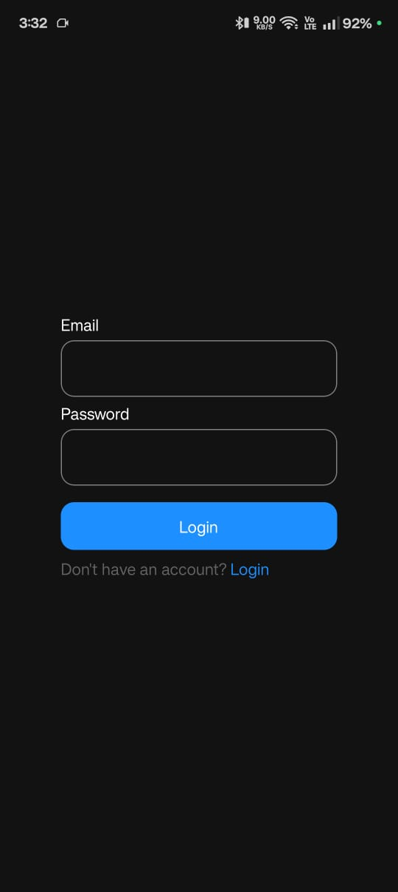
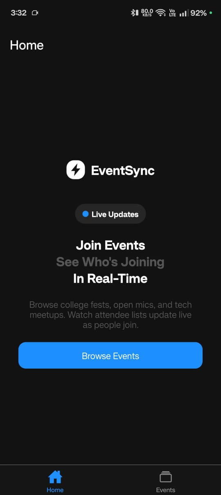
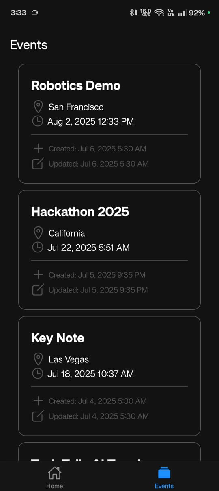
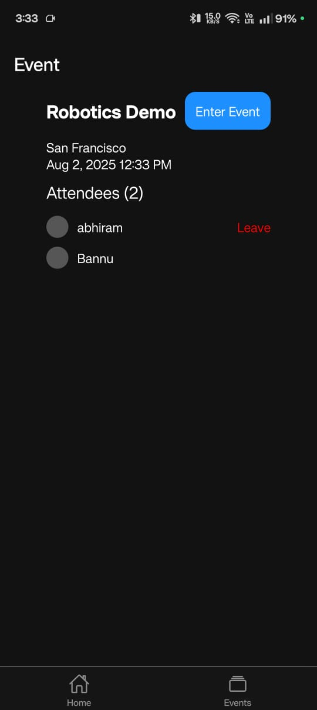

# 📲 Real-Time Event Check-In App

A full-stack event engagement app built with React Native (Expo) and Node.js + GraphQL + Prisma + PostgreSQL, featuring real-time updates via Socket.io.

## 🚀 Tech Stack

### Frontend

- React Native (Expo)
- TypeScript
- Zustand (state management)
- TanStack Query (data fetching)

### Backend

- Node.js
- TypeScript
- GraphQL
- Prisma (ORM)
- PostgreSQL (hosted on Neon)
- Socket.io (real-time communication)

## 📸 Screenshots






## 🎥 Demo Video

[▶️ watch demo](./media/demo/demo.mp4)

## 📦 Project Structure

```
/
├── server/ # Node.js backend
├── client/ # Expo frontend
```

## ⚙️ Setup Instructions

> 🔗 Important: Your mobile device and development machine must be on the same Wi-Fi network.

### 📁 1. Server Setup

1. Navigate to server directory:

   ```bash
   cd server
   ```

2. Install dependencies:

   ```bash
   npm install
   ```

3. Create .env file:

   ```env
   DATABASE_URL=your_postgres_database_url
   SECRET_KEY=your_secret_key
   ```

4. Run database migrations:

   ```bash
   npx prisma migrate dev --name init
   ```

5. Start the server:
   ```bash
   npm run dev
   ```

### 📱 2. Client Setup

1. Navigate to client directory:

   ```bash
   cd client
   ```

2. Install dependencies:

   ```bash
   npm install
   ```

3. Update server IP:

   - Open `client/api/event.ts` and `client/app/auth.ts`
   - Replace `base_url` constant with your local network IP (e.g., `http://192.168.x.x:8080`)

4. 💡 Find your IP:

   - Windows: `ipconfig`
   - macOS/Linux: `ifconfig` or `ip a`

5. Start Expo app:
   ```bash
   npm run start
   ```
   - Scan the QR code with Expo Go app on your phone.

## ✅ Features

- Browse upcoming events
- One-tap event check-in
- Real-time attendee updates via WebSocket
- Live participant list for each event
- JWT authentication

## 🔒 Environment Variables

| Variable     | Location      | Description               |
| ------------ | ------------- | ------------------------- |
| DATABASE_URL | .env (server) | PostgreSQL connection URI |
| SECRET_KEY   | .env (server) | Used for mock auth/tokens |
